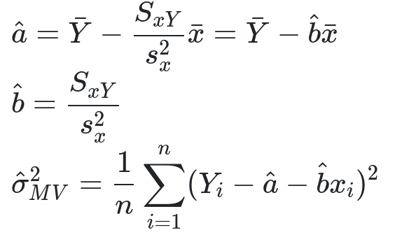
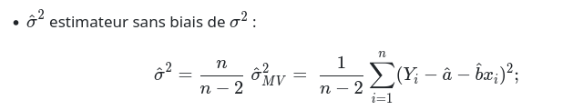
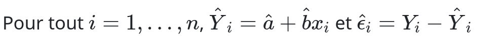
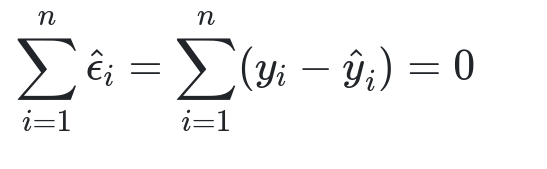
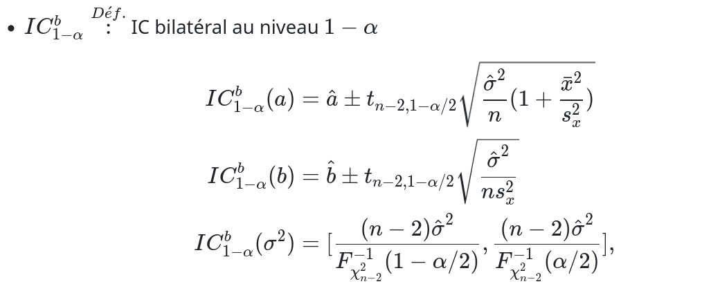

## 2 - Données simulées 

```{r}
a0<-round(runif(1,3,15),2)  
b0<-round(runif(1,1,5),2)  
s0<-round(runif(1,1,3),2)
```


### Q1a 

Nous pouvons générer n aléatoirement de la même manière que les valeurs précédentes (on considère la plage de valeurs possibles [200 ; 1000]) :

```{r}
n<- round(runif(1,20,100),0)
x<- runif(n,0,5)
```


Ainsi x est un vecteur qui contient les réalisations des VA Xi, qui suivent une loi uniforme sur [0;5].


### Q1b

D'après la partie 1, nous savons que *$Y_i$​=a+b $x_i$​+ $ϵ_i$​*. Cependant nous n'avons pas de valeur directe de **$ϵ_i$**. Or on a d'après l'énoncé :
$ϵ_i$​∼N(0,σ²). Ainsi, dans le cas de notre simulation, $ϵ_i$​∼N(0,$s_0$). Donc en R : 

```{r}
epsilon<- rnorm(n,0,s0)
y<- a0 + b0*x + epsilon
```


### Q2

Nous utilisons la fonction plot pour tracer les nuages de points (xi,yi). Pour ajouter une droite sur le même graphique nous utilisons la fonction abline. (qui permet de rejouter une droite sur un graphe.)

```{r}
plot(x, y,
     main = "(xi,yi) et droite de régression",
     xlab = "x", ylab = "y")

abline(a = a0, b = b0, col = "red")
```


### Q3 

D'après l'énoncé, nous avons les expressions des estimateurs de vraissemblance de a, b et σ² suivantes :



Cependant l'énoncé nous précise que cet estimateur de σ² **est biaisé**, or on nous demande de donner un estimateur non biaisé !!! Ainsi pour estimer σ² nous utilisons l'autre formule donnée par l'énoncé : 

Ainsi il nous suffit de créer ces fonctions grâce à nos simulations de x et y :

```{r}
b_estim <- function(x, y) {
  # dans l'énoncé on a : SxY = sum((x - mean(x)) * (y - mean(y))) et SxX = sum((x - mean(x))^2) d'où la fonction ...
  return (sum((x - mean(x)) * (y - mean(y))) / sum((x - mean(x))^2))
}

a_estim <- function(x, y) {
  # On a également Y barre = mean(y) 
  return(mean(y) - b_estim(x, y) * mean(x))
}

sigma_estim <- function(x, y) {
  n <- length(x)
  res <- y - a_estim(x, y) - b_estim(x, y) * x
  return(sum(res^2) / (n - 2))  
}
```


### Q4 

Pour obtenir une simulation de a, b et σ² à partir de notre jeu de données simulées, il suffit de calculer l'image des fonctions a_estim, b_estim et sigma_estime par x et y simulés. 

```{r}
b_estimé <- b_estim(x, y)
a_estimé <- a_estim(x, y)
s_estimé <- sigma_estim(x, y)

print(paste("Les réalisations simulées des estimateurs sont donc a_estimé =", a_estimé, "b_estimé =", b_estimé, "s_estimé =", s_estimé))
```


### Q5

Nous rajoutons également une légende avec la fonction legend afin d'avoir plus de clareté sur notre graphique.

```{r}
plot(x, y,
     main = "(xi,yi) et droite de régression",
     xlab = "x", ylab = "y")

abline(a = a0, b = b0, col = "red") #Droite y=a0+b0x

abline(a = a_estimé, b = b_estimé, col = "blue") #Droite des moindres carrés 

legend("topleft",
       legend = c("Droite y = a0 + b0*x","Droite des moindres carrés"),
       col = c("red", "blue"),
       lty = c(1, 1))
```


### Q6 

On a dans l'énoncé : 
Ainsi nous pouvons trouver le vecteur des résidus :

```{r}
y_moindre_carres <- a_estimé + b_estimé * x
#D'où le vecteur des résidus suivant ...
residus <- y - y_moindre_carres
```


Ainsi nous pouvosn vérifier la propriété des résidus de l'énoncé : 


```{r}
somme_residus <- sum(residus)
print(paste("La somme des résidus est donc égale à", somme_residus))
somme_differences <- sum(y - y_moindre_carres)
print(paste("La somme des différences est donc égale à", somme_differences))
```


On constate que les deux quantités sont égales, la **propriété des résidus est confirmée**.

### Q7

Vérifions dans un premier temps cette hypothèse graphiquement avec la fonction points qui nous permet de rajouter un point sur notre graphique :

```{r}
plot(x, y, 
     main = "Vérification que (x̄, ȳ) est sur la droite des MCO",
     xlab = "x", ylab = "y")

# Droite des MCO
abline(a = a_estim(x, y), b = b_estim(x, y), col = "blue", lwd = 2)

# Point moyen (x̄, ȳ)
points(mean(x), mean(y), col = "red")

# Étiquette
text(mean(x), mean(y), labels = "(x̄, ȳ)", pos = 3, col="red")
```


Nous constatosn graphiquement que (mean(x),mean(y)) **appartient à la droite des moindres carrés**. Nous pouvons aussi calculer y(mean(x)) et vérifier si cette quantité est égale à mean(y) :

```{r}
y_test <- a_estimé + b_estimé * mean(x)
print(y_test)
y_barre <- mean(y)
print(y_barre)
```


On a bien y(mean(x)) = mean(y), donc nous confirmons que (mean(x),mean(y)) **appartient à la droite des moindres carrés**.

### Q8


Nous réalisons donc une régression linéqire avec le couple (x,y) ...

```{r}
donnees <- data.frame(varx = x, vary = y)
reg<-lm(vary~varx, data = donnees)
summary(reg)
```


On constate alors :
- **Intercept (Estimate)** est l'estimation de a (a_estim)
- **varx (Estimate)** est l'estimation de b (b_estim)
- **Residual standard error** est l'estimation de sigma (sqrt(sigma_etim))

### Q9

Nous pouvons définir un vecteur de valeurs possibles pour n, que nous faisons prendre des valeurs de plus en plus grandes, puis pour chacune de ces valeurs nous prenon une réalisation simulée de x et y, et calculons les réalisations des estimations de a et de b associées. (Nous stockons chacune de ces valeurs dans un vecteur afin de pouvoir faire un graphique ultérieurement)

```{r}
tailles <- c(200,300,400,500,1000,1500,2000,3000,5000, 10000, 15000, 17000, 20000,25000, 50000,75000, 100000, 150000, 200000, 500000, 1000000)
a_vals <- c()
b_vals <- c()

for (i in tailles) {
  x_i <- runif(i, 0, 5)
  y_i <- a0 + b0 * x_i + rnorm(i, 0, sqrt(s0))
  a_vals <- c(a_vals, a_estim(x_i, y_i))  
  b_vals <- c(b_vals, b_estim(x_i, y_i))
}
```


Puis nous traçons les différentes valeurs de a estimées en fonctions de n, sur le même graphe on ajoute a0 afin demontre la convergence vers cette valeur :

```{r}

plot(tailles, a_vals, type = "l",
     main = "Convergence de â vers a0",
     xlab = "n", ylab = "â")
abline(h = a0, col = "red")
```


On fait de même avec b :

```{r}

plot(tailles, b_vals, type = "l",
     main = "Convergence de b̂ vers b0",
     xlab = "n", ylab = "b̂")
abline(h = b0, col = "red")
```


### Q10 

En suivant les indications, nous choisissons **n=200**, enfin nous simulons 150 réalisations de 200 couples de (x,y), que nous stockons dans unu vecteur grâce à la fonction replicate (dont nosu avons recherché le focntionnement avec la commande ?replicate).

De plus, nous calculons pour tout t une réalisation de l'estimateur de a, de même pour σ qui est égalament nécessaire pour le calcul demandé. Nous avons également besoin de mean(x) et sx :

```{r}
n_choisi <- 200
simulations <- replicate(150, { #replicate va directement stocker nos résultats dans un vecteur 

  x_sim <- runif(n_choisi, 0, 5)
  y_sim <- a0 + b0 * x_sim + rnorm(n_choisi, 0, sqrt(s0))

  a_estim_sim <- a_estim(x_sim, y_sim)
  sigma_estim_sim <- sigma_estim(x_sim, y_sim)

  return((a_estim_sim - a0) / sqrt((sigma_estim_sim / n_choisi) * (1 + mean(x_sim)^2 / var(x_sim)))) #expression de l'énoncé qui sera directement stockée dans un vecteur grâce à la fonction replicate
  
})
```


Enfin nous traçons ces quantités sur le même graphe que la loi de student de degrès 198 :

```{r}

#On trace l'histogramme de la quantité simulée au cours des 150 simulations 

hist(simulations, probability = TRUE,
     main = "Convergence vers Student(n-2)",
     xlab = "statistique", breaks = 20)

# On ajoute la densité d'un loi de student de degrès 198
curve(dt(x, df = 198), add = TRUE, col = "red")
```


**On constate graphiquement qu'il y a bien une convergence entre ces deux lois pour n=200**

### Q11 

D'après l'énoncé on a : 

Ainsi pour chaque calcul d'intervalle de confiance nous avosn besoins de fonction quantile de la loi du chi deux ainsi que celle de la loi de student, de la variance de X et des réalisations des estimateurs de a,b et sigma. Puis, en suivant simplement les formules, nous renvoyons un vecteur qui contient laplus petite valeur de l'estimateur (l'estimateur moins lamarge de confiance) et la plus grande (l'estimateur plus la marge de confiance) :

```{r}

# In tervalle de confiance pour a : 
gen_IC_a <- function(x, y, alpha) {
  a_est  <- a_estim(x, y)
  sig_est <- sigma_estim(x, y)
  varx     <- var(x)
  #Fonction quantile de la loi de student
  t_crit  <- qt(1 - alpha/2, df = n - 2)   
  
  marge <- t_crit * sqrt((sig_est / n) * (1 + mean(x)^2 / varx))
  c(a_est - marge, a_est + marge)
}

gen_IC_b <- function(x, y, alpha) {
  b_est   <- b_estim(x, y)
  sig_est <- sigma_estim(x, y)
  varx     <- var(x)
  t_crit  <- qt(1 - alpha/2, df = n - 2)
  
  marge <- t_crit * sqrt(sig_est / (varx * n))
  c(b_est - marge, b_est + marge)
}

gen_IC_s <- function(x, y, alpha) {
  sig_est <- sigma_estim(x, y)
  
  # fonction quantile de la loi du Chi-deux
  chi_inf <- qchisq(1 - alpha/2, df = n - 2)
  chi_sup <- qchisq(alpha/2,     df = n - 2)
  
  c((n - 2) * sig_est / chi_inf,
    (n - 2) * sig_est / chi_sup)
}
```


### Q12

Aucune valeur de alpha n'est précisée dans l'énoncé, nous décidonc alors de prendre alpha = 0.05 afin d'avoir une valeur nulérique pour chaque borne.

```{r}
alpha <- 0.05

intervalles_a_vect <- replicate(100, {
  x_sim <- runif(n_choisi, 0, 5)
  y_sim <- a0 + b0 * x_sim + rnorm(n_choisi, 0, sqrt(s0))
  
  gen_IC_a(x_sim, y_sim, alpha )
})

intervalles_b_vect <- replicate(100, {
  x_sim <- runif(n_choisi, 0, 5)
  y_sim <- a0 + b0 * x_sim + rnorm(n_choisi, 0, sqrt(s0))
  
  gen_IC_b(x_sim, y_sim, alpha )
})

intervalles_s_vect <- replicate(100, {
  x_sim <- runif(n_choisi, 0, 5)
  y_sim <- a0 + b0 * x_sim + rnorm(n_choisi, 0, sqrt(s0))
  
  gen_IC_s(x_sim, y_sim, alpha )
})
```


### Q13 

On commence par sourcer le nouceau fichier auquel nous faisons référence ...

```{r}
source("utils.R")
```


Puis on se sert de l'unique fonction de ce fichier, en prenant en paramètre les matrices des IC que l'on a trouvé grâce à la question précèdente ainsi que les paramètres rééls estimés donc ici a0, b0 et sigma0². Nous rajoutons également un titre afin de les différencier ...

```{r}
plot_ICs(intervalles_a_vect, mu = a0, main = "IC pour a")
plot_ICs(intervalles_b_vect, mu = b0, main = "IC pour b")
plot_ICs(intervalles_s_vect, mu = s0, main = "IC pour σ²")
```


**Commentaire** :

On remarque que pour les 3 coefficient, 100% des intervalles couvrent la valeur réélle du coefficient. Nous pouvions nous attendre à 95 % d'entre elles puisque nous avions pris alpha = 0.05. Cela paraît donc assez surprenant. Nous pouvons réessayer mais avec alpha = 0.5, dans ce cas nous devrions avoir à peu près 50% de rouge et 50% de vert, de même nous décidons d'augmenter le nombre d'intervalles calculées afin de réélement pouvoir voir une tendance se dessiner ...

```{r}
alpha <- 0.5

intervalles_a_vect <- replicate(10000, {
  x_sim <- runif(n_choisi, 0, 5)
  y_sim <- a0 + b0 * x_sim + rnorm(n_choisi, 0, sqrt(s0))
  
  gen_IC_a(x_sim, y_sim, alpha )
})

intervalles_b_vect <- replicate(10000, {
  x_sim <- runif(n_choisi, 0, 5)
  y_sim <- a0 + b0 * x_sim + rnorm(n_choisi, 0, sqrt(s0))
  
  gen_IC_b(x_sim, y_sim, alpha )
})

intervalles_s_vect <- replicate(10000, {
  x_sim <- runif(n_choisi, 0, 5)
  y_sim <- a0 + b0 * x_sim + rnorm(n_choisi, 0, sqrt(s0))
  
  gen_IC_s(x_sim, y_sim, alpha )
})


plot_ICs(intervalles_a_vect, mu = a0, main = "IC pour a avec alpha = 0.5")
plot_ICs(intervalles_b_vect, mu = b0, main = "IC pour b avec alpha = 0.5")
plot_ICs(intervalles_s_vect, mu = s0, main = "IC pour σ² avec alpha = 0.5")
```


Dans ce cas, cela est plyus visuel, on voir bien qu'il y a à peu près une moitié d'intervalles qui contiennent la vraie valeur pour chaque coefficient.


### Q14

Premièrement nous pouvons afficher les premières lignes du jeu de données anscombe afin de voir son nomre de colonnes etc ...

```{r}
head(anscombe)
```


On observe que ce jeu de données contient 4 *sous jeux* de données que nous pouvosn simplement tracer avec plot ... (de plus nous nous sommes renseignés sur anscombe avec lacommande ?anscombe)

```{r}
plot(anscombe$x1, anscombe$y1, main = "Graphique de (x1,y1)", xlab = "x1", ylab = "y1")
plot(anscombe$x2, anscombe$y2, main = "Graphique de (x2,y2)", xlab = "x2", ylab = "y2")
plot(anscombe$x3, anscombe$y3, main = "Graphique de (x3,y3)", xlab = "x3", ylab = "y3")
plot(anscombe$x4, anscombe$y4, main = "Graphique de (x4,y4)", xlab = "x4", ylab = "y4")
```


### Q15 

Nous nous servons de la fonction lm qui permet de faire une régression linéaire en R qui a été introduite en question 8. De même, nous décidons de tracer la droite  de régression linéaire afin de bien visualiser celle-ci et rendreplus aisée la discussion ...

**Pour le premier jeu de données** : 

```{r}
donnees1 <- data.frame(varx = anscombe$x1, vary = anscombe$y1)
reg1<-lm(vary~varx, data = donnees1)
summary(reg1)

plot(anscombe$x1, anscombe$y1, main = "Jeu 1", xlab="x1", ylab="y1")
abline(reg1, col = "red")
```


Ici on constate que le régression linéaire est correcte et adaptée.

**Pour le deuxième jeu de données** : 

```{r}
donnees2 <- data.frame(varx = anscombe$x2, vary = anscombe$y2)
reg2<-lm(vary~varx, data = donnees2)
summary(reg2)

plot(anscombe$x2, anscombe$y2, main = "Jeu 2", xlab="x2", ylab="y2")
abline(reg2, col = "red")
```


Ici on observe que la régression linéaire n'est pas du tout adaptée à la forme du jeu de données, notamment du à sa fome en cloche, quadratique, qui rends la regression linéaire très peu adaptée.


**Pour le troisième jeu de données** : 

```{r}
donnees3 <- data.frame(varx = anscombe$x3, vary = anscombe$y3)
reg3<-lm(vary~varx, data = donnees3)
summary(reg3)

plot(anscombe$x3, anscombe$y3, main = "Jeu 3", xlab="x3", ylab="y3")
abline(reg3, col = "red")
```


On constate ici que notre droite ne suit pas bien les données, à cause d'une valeur aberrante qui fausse complètement la pente de notre droite... Ainsi la regression linéaire ne paraît pas adaptée lorsque l'on a des valeurs aberrantes (à moins qu'il y en ai beaucoup ou qu'elles s'annulent il semble)

**Pour le quatrième jeu de données** : 

```{r}
donnees4 <- data.frame(varx = anscombe$x4, vary = anscombe$y4)
reg4<-lm(vary~varx, data = donnees4)
summary(reg4)

plot(anscombe$x4, anscombe$y4, main = "Jeu 4", xlab="x4", ylab="y4")
abline(reg4, col = "red")
```


Ici on constate très rapidement que la forme horizontale du jeu de données n'est pas du tout cohérente avec la regrssion linéaire ....